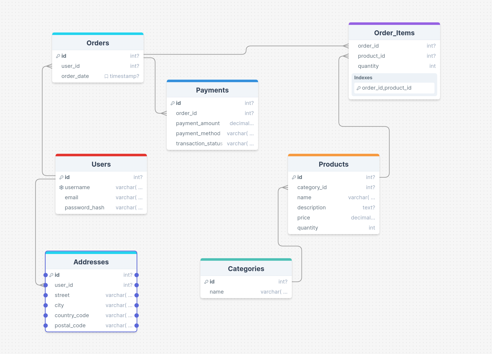

### Правки
Слегка переработаны таблицы

1) Убрано поле `total_price` из таблицы `Orders`, поскольку суммарная стоимость заказа может быть посчитана запросом вроде этого:
```sql
SELECT SUM(Products.price * Order_Items.quantity) AS total_price
FROM Order_Items
JOIN Products ON Order_Items.product_id = Products.id
WHERE Order_Items.order_id = <order_id>;
```
2) Заказ может содержать произвольное количество вещей, поскольку в таблице Order_Items содежится как поле `product_id`, так и поле `quantity`.

Пример запроса, который отобразит все вещи из заказа с указанным `id`
```sql
SELECT Orders.id, Products.name, Order_Items.quantity
FROM Orders
JOIN Order_Items ON Orders.id = Order_Items.order_id
JOIN Products ON Order_Items.product_id = Products.id
```

3) Для получения отношений, находящихся в третьей нормальной формой была выделена таблица `Addresses`.

# НИЯУ МИФИ. ИИКС. Лабораторная работа №1. Давыдов М., Б21-505. 2024.

## Обзор предметной области

Данная схема представляет собой модель платформы, специализирующейся на электронной коммерции. Она включает в себя следующий сущности и связи.

##### Сущности:

1. *Users*: Хранит информацию о пользователях платформы, включая их имя, почтовый адрес и хэш пароля.  
2. *Products*: Хранит информацию о продуктах, размещенных на платформе: имя, описание, стоимость и оставшееся количество на складе.
3. *Categories*: Хранит названия категорий продуктов, размещенных на платформе.
4. *Orders*: Хранит информацию о всех заказах, совершенных на платформе, включая дату их совершения, полную стоимость и отношение к пользователю, оставившему заказ.
5. *Order_Items*: Хранит связующую информацию о заказах и продуктах: одна запись соответствует одному продукту, относящемуся к одному заказу.
6. *Addresses*: Хранит информацию об адресах пользователей платформы, необходимую для оформления доставки: название улицы, города, почтовый код и код страны.
7. *Payments*: Хранит информацию о совершенных на платформе платежах: метод оплаты, сумма, а также текущий статус оплаты, для заморозки заказа до завершении транзакции.

## Спецификация таблиц

### Users
| Название Поля | Тип | Описание | Первичный ключ? | Внешний ключ? |
| --- | --- | --- | --- | --- |
| id | int | Идентификатор | да | нет |
| username | varchar| Логин | нет | нет |
| email | varchar | Адрес почты | нет | нет |
| password_hash | varchar | Хэш пароля | нет | нет |

### Products 

| Название Поля | Тип | Описание | Первичный ключ? | Внешний ключ? |
| --- | --- | --- | --- | --- |
| id | int | Идентификатор | да | нет |
| category_id | int | Идентификатор | нет | да |
| name | varchar | Название продукта | нет | нет |
| description | text | Описание продукта | нет | нет |
| price | numeric | Стоимость единцы продукта | нет | нет |
| quantity | int | Количество продукта на складе | нет | нет |

### Categories 

| Название Поля | Тип | Описание | Первичный ключ? | Внешний ключ? |
| --- | --- | --- | --- | --- |
| id | int | Идентификатор | да | нет |
| name | varchar | Название категории | нет | нет |

### Orders

| Название Поля | Тип | Описание | Первичный ключ? | Внешний ключ? |
| --- | --- | --- | --- | --- |
| id | int | Идентификатор | да | нет |
| user_id | int | Идентификатор | нет | да |
| order_data | timestamp | Время оформления заказа| нет | нет|
| total_price | numeric | Стоимость заказа | нет | нет|

### Categories 

| Название Поля | Тип | Описание | Первичный ключ? | Внешний ключ? |
| --- | --- | --- | --- | --- |
| id | int | Идентификатор | да | нет |
| order_id | int | Идентификатор | нет | да |
| product_id | int | Идентификатор | нет | да |
| quantity | int | Количество товара | нет | нет |


### Addresses

| Название Поля | Тип | Описание | Первичный ключ? | Внешний ключ? |
| --- | --- | --- | --- | --- |
| id | int | Идентификатор | да | нет |
| user_id | int | Идентификатор | нет | да |
| street | varchar | Название улицы и дома | нет | нет |
| city | varchar | Название города | нет | нет |
| coutry_code | varchar | Код страны | нет | нет |
| postal_code | varchar | Почтовый индекс | нет | нет |

### Payments

| Название Поля | Тип | Описание | Первичный ключ? | Внешний ключ? |
| --- | --- | --- | --- | --- |
| id | int | Идентификатор | да | нет |
| order_id | int | Идентификатор | нет | да |
| payment_amount | numeric | Сумма оплаты | нет | нет |
| payment_method| varchar | Метод оплаты | нет | нет |
| transaction_status | varchar | | нет | нет |

## Диаграмма сущностей



## Доказательство 3 нормальной формы

- [x] Порядок строк не несет в себе информации (очевидно)
- [x] У столбца определенный тип данных и только он (механизм работы СУБД).
- [x] Есть первичный ключ (есть везде).
- [x] Повторяющиеся группы не разрешены(все PRIMARY уникальны)
- [x] Каждый столбец зависит только от первичного ключа - да
- [x] Каждый столбец зависит только от первичного ключа, полного первичного ключа и только от него - да.

## Приложение

[SQL сценарий для создания таблиц](./init.sql)

## Заключение

Была смоделирована структура базы данных для платформы, занимающейся электронной коммерицей. Были описаны сущности, их атрибуты и связи между ними. Была построена диаграмма сущностей.
