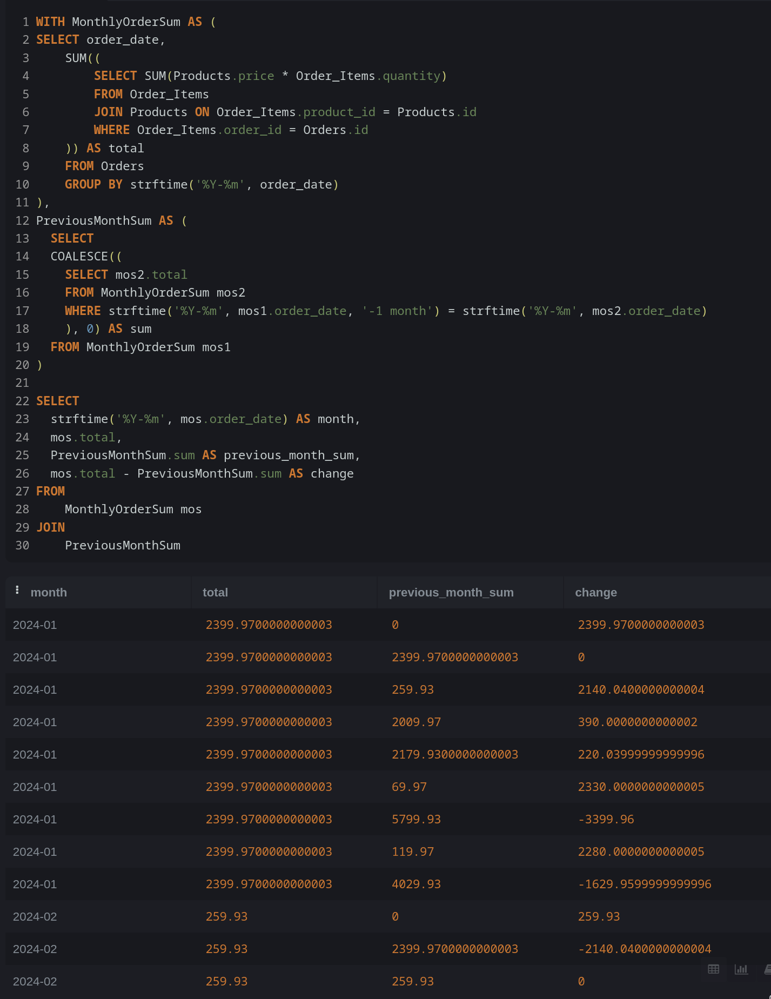
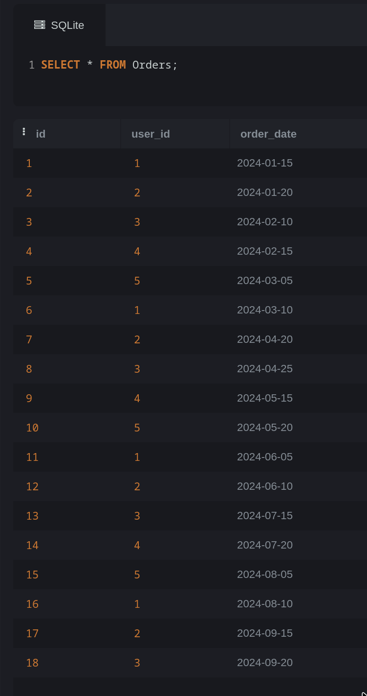

## Правки
Для каждого месяца, по которому есть информация в Orders, выведите, насколько сумма заказов в этом месяце изменилась по сравнению с суммой заказов в прошлом месяце. Если информации по месяцу нет, считать сумму заказов = 0. 

1) Для группирования суммы заказов по месяцам можно воспользоваться данным запросом:
```sql
 SELECT order_date,
 SUM((
        SELECT SUM(Products.price * Order_Items.quantity)
        FROM Order_Items
        JOIN Products ON Order_Items.product_id = Products.id
        WHERE Order_Items.order_id = Orders.id
    )) as total
    FROM Orders
    GROUP BY strftime('%Y-%m', order_date)
```

2) Используя полученный результат можно посчитать разницу с предыдущим месяцем, обратившись по соответствующим месяцам:
(Функция COALESCE была НАГУГЛЕНА)
```sql 
WITH MonthlyOrderSum AS (
SELECT order_date,
    SUM((
        SELECT SUM(Products.price * Order_Items.quantity)
        FROM Order_Items
        JOIN Products ON Order_Items.product_id = Products.id
        WHERE Order_Items.order_id = Orders.id
    )) as total
    FROM Orders
    GROUP BY strftime('%Y-%m', order_date)
),
PreviousMonthSum AS (
  SELECT 
  COALESCE((
    SELECT mos2.total
    FROM MonthlyOrderSum mos2
    WHERE strftime('%Y-%m', mos1.order_date, '-1 month') = strftime('%Y-%m', mos2.order_date)
    ), 0) AS sum
  FROM MonthlyOrderSum mos1
)
SELECT 
  strftime('%Y-%m', mos.order_date) as month,
  mos.total,
  PreviousMonthSum.sum as previous_month_sum,
  mos.total - PreviousMonthSum.sum AS change
FROM
	MonthlyOrderSum mos
JOIN
	PreviousMonthSum
```
### Результат выполнения


### Результат содержимое таблицы Orders



# НИЯУ МИФИ. ИИКС. Лабораторная работа №2. Давыдов М, Б21-505. 2024.

## Генерация тестовых данных

Ниже представлены SQL запросы, использованные для заполнения таблиц из `init.sql` тестовыми данными.

```sql
-- Users
INSERT INTO Users (username, email, password_hash)
VALUES 
    ('user1', 'user1@example.com', 'hash1'),
    ('user2', 'user2@example.com', 'hash2'),
    ('user3', 'user3@example.com', 'hash3');

-- Categories
INSERT INTO Categories (name)
VALUES 
    ('Category 1'),
    ('Category 2'),
    ('Category 3');

-- Products
INSERT INTO Products (category_id, name, description, price, quantity)
VALUES 
    (1, 'Product 1', 'Description 1', 10.99, 100),
    (2, 'Product 2', 'Description 2', 15.49, 150),
    (3, 'Product 3', 'Description 3', 20.99, 200);

-- Orders
INSERT INTO Orders (user_id, total_price)
VALUES 
    (1, 50.00),
    (2, 35.00),
    (3, 45.00);

-- Order_Items
INSERT INTO Order_Items (order_id, product_id, quantity)
VALUES 
    (1, 1, 2),
    (1, 2, 1),
    (2, 2, 3),
    (3, 3, 2);

-- Addresses
INSERT INTO Addresses (user_id, street, city, country_code, postal_code)
VALUES 
    (1, 'Street 1', 'City 1', 'US', '12345'),
    (2, 'Street 2', 'City 2', 'UK', '54321'),
    (3, 'Street 3', 'City 3', 'CA', '67890');

-- Payments
INSERT INTO Payments (order_id, payment_amount, payment_method, transaction_status)
VALUES 
    (1, 50.00, 'Credit Card', 'Success'),
    (2, 35.00, 'PayPal', 'Success'),
    (3, 45.00, 'Stripe', 'Success');
```


## Разработанные запросы

### Вывод информации о всех заказах


### Подсчет количества совершенных транзакций на платформе


### Вывод информации о продуктах платформы, отсортированных по возрастанию цены


### Вывод названий товаров, цена которых меньше наименьшей среди активных заказов


### Вывод средней стоимости заказов


### Вывод информации о товарах с ценой, меньшей последнего оформленного заказа.


## Заключение

В ходе выполнения задания таблицы из предыдущего задания были заполнены тестовыми данными и освоен механизм выбора из таблицы.
