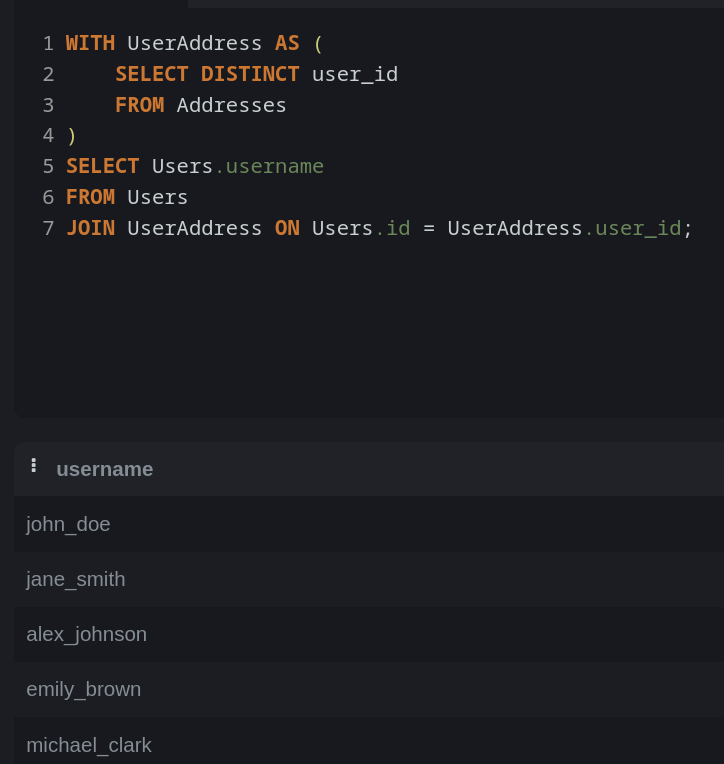

## Правки
1. Корректный скриншот информации о пользователях и их заказах:


2. Исправленный запрос на получение информации о пользователях, совершивших хотя бы один заказ (делается это за счет INNER JOIN пересечения по трем таблицам)
```sql 
SELECT Users.username, Users.email, Addresses.street, Addresses.city, Addresses.postal_code
FROM Users
JOIN Orders  ON Users.id = Orders.user_id
JOIN Addresses ON Users.id = Addresses.user_id
```

3. Вывести только те коды стран, где суммарная штучность (quantity) проданных товаров сокращалась в течение двух месяцев подряд. Выведите код страны, текущую штучность проданных товаров и общую величину падения. Отсортировать по убыванию абсолютного значения величины падения.

    1. Для получения суммарной штучности по странам в соответствии с месяцем воспользуемся запросом аналогичным из 

```sql
SELECT strfmt('%y-%m', order_date) as month,
    Addresses.country_code,
    SUM(Order_items.quantity)
FROM Orders
JOIN
    Order_Items ON Orders.id = Order_Items.order_id
JOIN
    Addresses on Orders.user_id = Addresses.user_id
GROUP BY month, Addresses.country_code
```

3. 2. Для получения суммарного количества продаж воспользуемся следующим запросом
```sql 
WITH MonthlySales AS (
    SELECT order_date as month,
        Addresses.country_code,
        SUM(Order_items.quantity) as total
    FROM Orders
    JOIN
        Order_Items ON Orders.id = Order_Items.order_id
    JOIN
        Addresses on Orders.user_id = Addresses.user_id
    GROUP BY month, Addresses.country_code
)
SELECT 
	M1.country_code, M1.month, M1.total,
    COALESCE(M2.total, 0) as prev_quantity,
    COALESCE(M3.total, 0) as prev_prev_quality
FROM MonthlySales M1
join  
-- Я очень не уверен, что это оптимальный путь, но другого не нашел
	MonthlySales M2 ON M2.country_code = M1.country_code AND strftime('%Y-%m', M1.month, '-1 month') = strftime('%Y-%m', M2.month)
JOIN
	MonthlySales M3 ON M3.country_code = M1.country_code AND strftime('%Y-%m', M1.month, '-2 month') = strftime('%Y-%m', M3.month);
```

3. 3. И наконец, для получения из результата прошлого запроса только те месяца, в которых идет постоянный спад в количестве продаж
```sql 
WITH MonthlySales AS (
    SELECT order_date as month,
        Addresses.country_code,
        SUM(Order_items.quantity) as total
    FROM Orders
    JOIN
        Order_Items ON Orders.id = Order_Items.order_id
    JOIN
        Addresses on Orders.user_id = Addresses.user_id
    GROUP BY month, Addresses.country_code
),
TotalWithPrevious AS (
  SELECT 
		M1.country_code, M1.month, M1.total,
    	COALESCE(M2.total, 0) as prev_quantity,
    	COALESCE(M3.total, 0) as prev_prev_quantity
	FROM MonthlySales M1
	join  
-- Я очень не уверен, что это оптимальный путь, но другого не нашел
		MonthlySales M2 ON M2.country_code = M1.country_code AND strftime('%Y-%m', M1.month, '-1 month') = strftime('%Y-%m', M2.month)
	JOIN
		MonthlySales M3 ON M3.country_code = M1.country_code AND strftime('%Y-%m', M1.month, '-2 month') = strftime('%Y-%m', M3.month)
),
Decline AS (
    SELECT 
        country_code,
        month,
        total,
        prev_quantity,
        prev_prev_quantity,
        prev_prev_quantity - total AS total_drop
    FROM 
        TotalWithPrevious
    WHERE 
        prev_quantity > total AND prev_prev_quantity > prev_quantity
)
SELECT 
    country_code,
    total AS current_quantity,
    total_drop
FROM 
    Decline
ORDER BY 
    ABS(total_drop) DESC;
```

# НИЯУ МИФИ. ИИКС. Лабораторная работа №3. Давыдов М. Б21-505. 2024.  

## Разработанные запросы

### Перечислить информацию о всех пользователях и продуктах, которые они заказывали.
```sql
SELECT Orders.id AS order_id, Users.username, Products.name AS product_name
FROM Orders
JOIN Users ON Orders.user_id = Users.id
JOIN Order_Items ON Orders.id = Order_Items.order_id
JOIN Products ON Order_Items.product_id = Products.id;
```


### Получить информацию о том, сколько всего потратил пользователь.
```sql
SELECT Users.username, SUM(Orders.total_price) AS total_spent
FROM Users
JOIN Orders ON Users.id = Orders.user_id
GROUP BY Users.username;
```


### Полчить информацию о пользователях, которые совершили хотя бы один заказ и указали адрес доставки.
```sql
WITH UserAddress AS (
    SELECT DISTINCT user_id
    FROM Addresses
)
SELECT Users.username
FROM Users
JOIN UserAddress ON Users.id = UserAddress.user_id;
```



### Перечислить все категории и посчитать количество товаров в каждой.
```sql
SELECT Categories.name, COUNT(Products.id) AS product_count
FROM Categories
LEFT JOIN Products ON Categories.id = Products.category_id
GROUP BY Categories.name;
```


### Получить информацию о продукте, включая категорию и количество заказанных единиц
```sql
SELECT Products.name AS product_name, Categories.name AS category_name, SUM(Order_Items.quantity) AS total_ordered
FROM Products
JOIN Categories ON Products.category_id = Categories.id
LEFT JOIN Order_Items ON Products.id = Order_Items.product_id
GROUP BY Products.name, Categories.name;
```


### Перечислить пользователей и их методы оплаты
```sql
SELECT DISTINCT Users.username, Payments.payment_method
FROM Users
JOIN Orders ON Users.id = Orders.user_id
JOIN Payments ON Orders.id = Payments.order_id;
```


### Получить пересечение пользователей, совершавших заказы и указавших адрес доставки
```sql
WITH OrderUsers AS (
    SELECT DISTINCT user_id
    FROM Orders
),
AddressUsers AS (
    SELECT DISTINCT user_id
    FROM Addresses
)
SELECT Users.username
FROM Users
JOIN OrderUsers ON Users.id = OrderUsers.user_id
INTERSECT
SELECT Users.username
FROM Users
JOIN AddressUsers ON Users.id = AddressUsers.user_id;
```


### Получить информацию о сумме потраченной пользователями, а также о товарах, заказанных ими
```sql
SELECT Users.username, Products.name AS product_name, Orders.order_data
FROM Users
JOIN Orders ON Users.id = Orders.user_id
JOIN Order_Items ON Orders.id = Order_Items.order_id
JOIN Products ON Order_Items.product_id = Products.id
ORDER BY Users.username, Orders.order_data DESC;
```


## Заключение

Были разработы и продемонстрированы более сложные запросы к базе данных.
